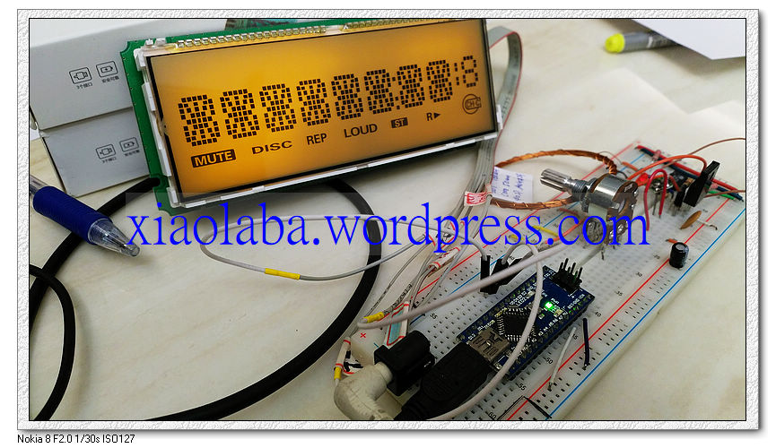
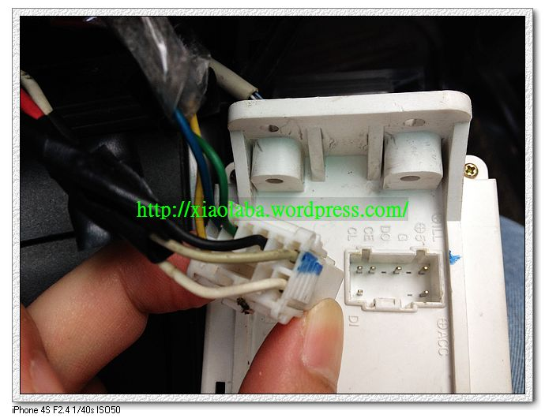

# Savrin_LC75854E

Savrin, a car, panasonic car audio, LCD module, chipset LC75854, CBB bus and test program
 
16-segment charecter, few segment for symbol
 

  
  
  
testing log, clcik to see video following,
 

The library SanyoCCB.cpp, original copy from https://github.com/RodLophus/SanyoCCB  
modified to fit for LC75854, does NOT compatible with the origial.  

single connection,
Arduino pin,    GND, D3, D4, D5, all output
LCD module pin, GND, DI, CL, CE, all input, interal has 1k resistor for each

Power connection,  
LCD module pin, +IL, backlight, connect to 12V power source. Interal has 9V regulator.  
LCD module pin, +ACC, connect to 12V power source, Interal has simple Zener regulator to 5V for LC75854.  
LCD module pin, O, GND.  

Panasonic Car audio CQ-JB147AA_B LCD connector.jpg

 
 